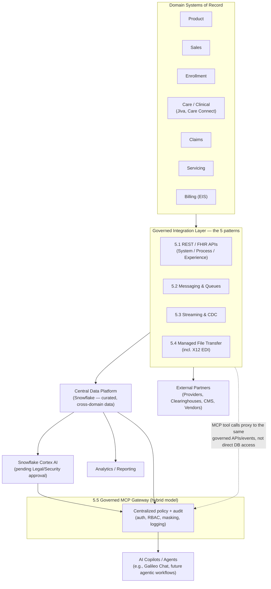

# Modernizing the Integration Landscape: An Essential-Pattern Strategy for AI- and Cloud-Ready Healthcare Enterprise Architecture

**A position paper from Enterprise Architecture**
**Audience:** CIO, CTO, and senior technology leadership
**Prepared by:** Enterprise Architecture (Head of EA)
**Date:** September 2026
**Status:** For executive review and decision

---

## How to use this document

This paper is written as an EA position paper — a point of view backed by research — rather than a finished implementation plan. It is intended to (1) frame the problem in terms executives can act on, (2) recommend a small, defensible set of integration patterns that should become the *only* supported ways to connect to our platform, and (3) give the Enterprise Architecture team and its counterparts in Legal, Security, and each domain a shared research base for the discussions that will follow. Section 10 lists every external source consulted, organized by topic, so the team can go deeper on any thread.

---

## 1. Executive Summary

Our integration landscape has grown the way most 20+ year-old healthcare enterprises' landscapes grow: one urgent project at a time, across Product, Sales, Enrollment, Care/Clinical, Claims, Servicing, and Billing, using whatever tool a given team already knew — Boomi, Ab Initio, Spark jobs, point-to-point web services, ad hoc SFTP drops, and more. Each choice was locally reasonable. Collectively, they have produced a landscape that is expensive to run, slow to extend, hard to secure consistently, and not ready for two forces that are now non-negotiable:

1. **Regulatory-grade interoperability.** CMS-0057-F requires standardized FHIR-based Patient Access, Provider Access, Payer-to-Payer, and Prior Authorization APIs, with API build deadlines beginning **January 1, 2027**. This is not optional, and it forces a real API layer whether or not we plan one.
2. **AI and agentic consumption of enterprise data.** Our central data platform is moving to Snowflake, with AI/Cortex capabilities pending Legal and Security sign-off, and a new integration protocol — MCP (Model Context Protocol) — is emerging as the standard way AI agents discover and call enterprise tools and data. MCP is powerful but, in its default form, under-governed; it needs to be adopted deliberately, not organically, or it will recreate the same sprawl we are trying to eliminate — with a security profile that is materially worse.

**The position:** Enterprise Architecture recommends collapsing our supported integration surface down to **five governed patterns** — REST/FHIR APIs, Messaging/Queues, Streaming/CDC, Managed File Transfer (the governed successor to ad hoc SFTP), and a centrally governed MCP gateway for AI/agentic access — each with one preferred technology stack, a small number of approved use cases, and an explicit deprecation path for everything that doesn't fit. This is not a proposal to rebuild the landscape; it is a proposal to stop growing it in every direction and instead let the central data platform (Snowflake) and a thin, well-governed integration layer do the work that dozens of point tools do today.

The prize is real: McKinsey's payer research estimates AI-enabled transformation can deliver **$150–300M in administrative savings, $380–970M in medical cost reduction, and $260M–$1.24B in revenue gains per $10B of payer revenue** — but only for organizations whose data and integration foundation can actually support AI at scale. A sprawling, ungoverned integration layer is the single biggest blocker to capturing that value, and it is also the biggest source of unmanaged risk once AI agents start reading from and writing to our systems.

---

## 2. Where We Are Today

- **Domain sprawl, multiplied by integration sprawl.** Product, Sales, Enrollment, Care/Clinical, Claims, Servicing, and Billing each have their own long-lived application landscapes. Every cross-domain need has historically been solved by a bespoke integration, not a shared capability.
- **Tool sprawl.** Boomi (iPaaS), Ab Initio (ETL/batch), Spark jobs (custom big-data pipelines), plus an unknown number of point-to-point services, scripts, and SFTP jobs, are all in production simultaneously, each with its own operational model, monitoring, credentials, and skills requirement.
- **A central data platform is coming.** Curated, domain-owned data is being landed centrally and wired across domains, moving to Snowflake. Snowflake's AI/Cortex capabilities are anticipated but gated on Legal and Security approval — which is the right sequencing, and this paper assumes that gate stays in place until those teams are satisfied.
- **No single governed "front door."** Internal and external parties currently integrate through whatever pattern the last project used, not through a small set of sanctioned, documented, and monitored patterns.
- **New consumers are arriving faster than governance can react.** AI copilots, agents, and (soon) MCP-based tool access will want to read and act on the same systems as our human-built integrations, and they will not wait for a multi-year modernization program.

This is not unique to us. Industry commentary on "application integration chaos" describes the same pattern everywhere: organic technology sprawl, inconsistent standards, and teams choosing whatever integration tool they already know rather than what governance prescribes (Architecture & Governance Magazine — see §10.7). The fix that keeps recurring across sources — TOGAF guidance, MuleSoft/Boomi practitioner literature, and IBM's own governance guidance — is the same: **stop treating integration technology choice as a project-by-project decision, and instead publish a small, standards-based catalog that is preferred, acceptable, or prohibited for each usage scenario.**

---

## 3. Why Now — Three Converging Forces

### 3.1 Regulation is setting a hard deadline
CMS-0057-F (the CMS Interoperability and Prior Authorization Final Rule) requires impacted payers to expose four FHIR-based APIs — **Patient Access, Provider Access, Payer-to-Payer, and Prior Authorization** — built on HL7 FHIR 4.0.1, USCDI, SMART App Launch, and OpenID Connect, with most operational requirements starting January 1, 2026 and API build/enhancement deadlines beginning **January 1, 2027**. HL7's Da Vinci Project implementation guides (PAS, PDex) are the concrete technical specifications CMS points to. This is the forcing function that guarantees a real, standards-based API layer will exist in our landscape whether Enterprise Architecture leads it or not — which is exactly why EA should lead it, so the CMS-mandated APIs become the front door for *all* FHIR-shaped data exchange rather than a fifth parallel integration stack.

### 3.2 Cloud and AI are colliding with decades-old systems
The center of gravity for data is moving to a cloud data platform (Snowflake), and AI capabilities (Cortex, Copilot-style assistants, agents) are being layered on top. None of this replaces the domain systems of record — it sits alongside them. The practical challenge industry research keeps surfacing (McKinsey; Boomi's healthcare payer modernization guidance) is not "replace the legacy core," it's **"build a modern integration and API layer on top of the legacy core so new capabilities don't have to touch it directly."** One global insurer cited in McKinsey's research did exactly this: a modern integration layer over region-specific legacy cores, without core replacement.

### 3.3 AI agents need a new, and currently under-governed, connection pattern
MCP (Model Context Protocol) has emerged over the last two years as the de facto standard for connecting AI agents to tools and data — analogous to what REST/JSON did for web APIs. Snowflake itself now offers **managed MCP servers** that expose Cortex Analyst and Cortex Search through MCP while keeping RBAC, masking, and governance policy enforcement inside Snowflake's existing security perimeter. This is attractive: it means AI-facing integration doesn't have to be invented from scratch, it can inherit our existing data governance. But MCP's own governing bodies are candid about the risk: **NSA/CISA guidance states plainly that MCP does not mandate authentication or authorization, that many real deployments omit access controls entirely, and that its client–server trust model inverts the usual assumptions in ways that create "largely untraced attack paths."** The March–July 2026 MCP specification updates (issuer-bound tokens, RFC 9207 compliance, Enterprise Managed Authorization) are real hardening steps, but they are protocol *capabilities*, not guarantees — an enterprise still has to choose to deploy them behind a governed gateway. Left ungoverned, MCP will reproduce our current integration sprawl inside a matter of months, with a worse security posture, because every team building an AI feature will stand up its own MCP server the way past teams stood up their own SFTP job or Boomi process.

---

## 4. Guiding Principles for the Target State

1. **Five patterns, not fifty.** Every new integration need must be met by one of five governed patterns (§5). If none fits, that is an architecture exception requiring EA and Security sign-off, not a default.
2. **API-first, data-platform-centric.** The central Snowflake data platform, not point-to-point wiring, is the default way domains share data with each other. Direct application-to-application integration is the exception, reserved for cases the data platform genuinely cannot serve (e.g., low-latency transactional calls).
3. **Standards over tools.** We standardize on *protocols and standards* (REST/OpenAPI, FHIR/HL7, AMQP/Kafka wire formats, MFT/SFTP-over-TLS, MCP) rather than committing the whole enterprise to a single vendor. This keeps us switching-cost-resilient as the iPaaS and AI-tooling markets continue to consolidate.
4. **One governed front door for AI/agentic access.** No system exposes itself directly to an AI agent. All AI/agentic consumption goes through a centrally governed MCP gateway layer that inherits the same identity, RBAC, masking, and audit controls as our human-facing APIs.
5. **Everything is inventoried, owned, and has a sunset date if it doesn't fit.** Rationalization is a continuous governance function, not a one-time project (see §7's Integration Competency Center model).
6. **Security and compliance are designed in, not bolted on.** Zero-trust principles (NIST SP 800-207), HIPAA/PHI handling rules, and CMS-0057-F consent/opt-in requirements apply uniformly across all five patterns.

---

## 5. The Five Essential Patterns

The brief specifically asked for REST API, Messaging/Queues, Streaming, SFTP, and MCP to be supported. Below is the EA position on *how* each should be supported — narrowly, with one preferred stack and a clear boundary — rather than the current "anything goes" state.

### 5.1 REST / FHIR APIs — the default synchronous interface

**What it's for:** Request/response interactions — a portal looking up a member's eligibility, a provider portal submitting a prior authorization, an external partner querying claims status, internal services calling shared capabilities.

**What "good" looks like:**
- API-led connectivity, layered as **System APIs** (thin, standards-based wrappers directly over domain systems of record — Jiva, Care Connect, EIS, claims, billing), **Process APIs** (orchestrate/combine System APIs into a business capability, e.g., "get member 360"), and **Experience APIs** (channel-specific — member portal, provider portal, partner API) — the pattern MuleSoft and most enterprise-integration practitioners now treat as the standard decomposition. This is precisely what prevents new consumers from wiring directly into legacy systems: every new channel talks to an Experience API, not to Jiva or EIS directly.
- **FHIR R4 / HL7** for anything clinical, claims, or member-data shaped, aligned to the Da Vinci PAS (Prior Authorization Support) and PDex (Payer Data Exchange) implementation guides, which is exactly the technical foundation CMS-0057-F points to. Building the CMS-mandated Patient Access, Provider Access, Payer-to-Payer, and Prior Authorization APIs on this same System/Process/Experience layering means regulatory compliance and our internal API strategy become the *same* investment, not two competing ones.
- **OpenAPI/Swagger** as the contract standard for non-FHIR REST APIs, published through a single API gateway/catalog so every API is discoverable, versioned, and governed centrally rather than departmentally.
- **OAuth 2.0 / OpenID Connect / SMART App Launch** for authentication and authorization — SMART App Launch specifically because CMS-0057-F requires it for the patient- and provider-facing FHIR APIs.

**What it replaces:** Ad hoc point-to-point web service calls between domain systems, one-off REST endpoints stood up per project without a shared gateway, and any remaining SOAP interfaces that aren't tied to a vendor contract we can't change.

### 5.2 Messaging / Queues — the default for reliable, asynchronous, transactional handoffs

**What it's for:** Work that must happen exactly once, in order, and survive a downstream outage — enrollment transactions, claims adjudication hand-offs, billing events, anything where "the request is accepted and will be processed" matters more than an immediate response.

**What "good" looks like:** A small number of managed queue/broker technologies (the specific product choice is an implementation decision for the integration team, but the *pattern* — durable, ordered, at-least-once delivery with dead-letter handling — is the EA mandate), fronted by the same Process API layer described above so producers and consumers don't need to know the underlying broker.

**What it replaces:** Custom polling loops, database-table-as-queue anti-patterns, and any remaining batch jobs that exist only because no reliable async mechanism was available when they were built.

### 5.3 Streaming — the default for continuous, high-volume, real-time data movement

**What it's for:** Change data capture out of core systems of record, high-volume clinical/claims event flows, and feeding the central data platform in near-real time instead of via nightly batch.

**What "good" looks like:** Two patterns, both well precedented in healthcare payer environments per Confluent's published case material:
1. **Native event production** — core systems (e.g., claims platforms) emit events directly onto a streaming backbone, which downstream consumers (including Snowflake) subscribe to.
2. **Change Data Capture (CDC)** — for the many legacy databases that will never natively emit events, CDC tooling (e.g., Oracle GoldenGate-class connectors) captures row-level changes and republishes them onto the same streaming backbone.

Both patterns land in the same place: **Snowflake**, via **Snowflake Openflow** (Snowflake's managed, NiFi-based integration service, which natively supports Kafka ingestion, CDC replication, batch, and SaaS connectivity, either fully managed or bring-your-own-cloud for data that must stay inside our network boundary) or native Snowpipe Streaming. This is the single most important consolidation opportunity in this paper: **streaming + CDC + batch ingestion collapsing onto one managed service, instead of a different bespoke pipeline per domain**, is exactly how Ab Initio- and Spark-job sprawl gets retired over time rather than merely frozen in place.

**What it replaces:** The long tail of custom Spark jobs and Ab Initio graphs that exist purely to move data from a domain system into a warehouse/lake — the majority of which are candidates to become either (a) a native Kafka/event producer, (b) a CDC feed, or (c) a scheduled Openflow batch connector, all governed the same way.

### 5.4 Managed File Transfer — the governed successor to ad hoc SFTP

**What it's for:** Bulk file exchange with external partners (providers, clearinghouses, government agencies, vendors) who require file-based exchange — X12 EDI (837 claims, 835 remittance, 270/271 eligibility) being the biggest healthcare-specific example — and internal legacy batch hand-offs that cannot be migrated to an API or event in the near term.

**What "good" looks like:** SFTP itself isn't going away — X12 EDI and many payer/clearinghouse relationships are contractually SFTP-based and will be for years — but *ad hoc* SFTP (scripts on a server, credentials in a config file, no central visibility) should be retired in favor of a **Managed File Transfer (MFT) platform**: centralized credential/key management, automatic encryption in transit and at rest, full audit trail of every file movement, and policy-based routing. Industry guidance (Kiteworks, IBM, Axway) is consistent that the risk in "SFTP" integrations is almost never the protocol itself, it's the absence of governance around who has keys, where files land, and whether transfers are logged — exactly the gap MFT closes.

**What it replaces:** Every unmanaged SFTP script, cron job, and shared-credential file drop currently running outside a governed MFT platform. This is realistically the fastest, lowest-risk footprint-reduction win available, because it doesn't require re-architecting the *data*, only re-platforming *how it moves*.

### 5.5 MCP — the single governed gateway for AI and agentic access

**What it's for:** AI copilots and agents (internal productivity tools, the Galileo Chat AI platform, future agentic workflows) that need to query or act on enterprise data and systems using natural-language-driven tool calls, rather than hand-written integration code per AI feature.

**What "good" looks like, based on current practitioner and vendor guidance:**
- **Exactly one governance model, chosen deliberately** from the three patterns the integration literature converges on: a **centralized MCP gateway** (single policy enforcement point, best when unified oversight matters more than data isolation), a **distributed agent-per-system model** (one MCP server per trust boundary — the model regulated, HIPAA-scoped domains like Claims and Care/Clinical should default to, because it gives the strongest per-system data isolation), or a **hybrid model** (cloud-hosted MCP agents for SaaS tools, on-premises MCP agents for sensitive legacy systems, coordinated by a shared control plane). Given our mixed cloud/on-prem, multi-domain, PHI-heavy environment, EA's recommendation is the **hybrid model**, with the on-premises/regulated-domain agents defaulting to the distributed, per-system isolation pattern.
- **MCP does not replace the integration architecture underneath it** — this is the single most important governance insight from current MCP literature. It changes only the interface between AI and our systems; every MCP tool call should ultimately be backed by the *same* governed System/Process API, event stream, or Snowflake object we already built for human-facing integration, not a parallel, ungoverned path into a legacy database. Practically: MCP tools are a *consumption layer on top of* Patterns 5.1–5.4, not a sixth, independent pattern.
- **Where the data already lives in Snowflake, prefer Snowflake's own managed MCP servers** (Cortex Analyst / Cortex Search exposed via MCP), because they inherit our existing Snowflake RBAC, data masking, and governance policy without new infrastructure — this is a direct, low-risk on-ramp for the AI use cases that are purely analytical/read-oriented, and it keeps data inside Snowflake's governance perimeter rather than letting it leave through a bespoke connector. This should be the reference pattern once Legal/Security clear Snowflake's AI capabilities for use.
- **Non-negotiable security controls**, straight from NSA/CISA and current MCP governance guidance: OAuth 2.1 with scoped tokens (never hard-coded credentials in server configs), least-privilege/deny-by-default tool access per agent (not per organization), strict schema validation on every tool parameter, sandboxed execution for any self-hosted MCP server, full audit logging of every tool invocation into our SIEM, and an explicit, owned inventory of every MCP server running in the enterprise (the same inventory discipline recommended for APIs, applied here because "shadow MCP servers" are already a recognized enterprise risk pattern).

**What it replaces:** Nothing yet exists in production to replace — this is the pattern we most need to get ahead of, because the alternative isn't "no MCP," it's "ungoverned MCP springing up team-by-team," which is a strictly worse outcome than the sprawl we already have.

### 5.6 A note on what's deliberately *not* a sixth pattern

Two things sit outside the five patterns and should be named as such, not left ambiguous:
- **Reverse ETL** (pushing curated Snowflake data back into operational systems — e.g., a care-management flag computed centrally, pushed back into Care Connect) is not a new integration technology; it is a specific *use* of Pattern 5.1 (API) or 5.3 (streaming/CDC in reverse), and should be governed the same way. Naming it separately in tooling conversations, without naming it separately in governance, avoids a sixth silo.
- **Agent-to-Agent (A2A) protocols**, for scenarios where multiple autonomous agents must coordinate with each other (not just call tools), are an emerging, related but distinct concern from MCP. Current practitioner guidance (Google Cloud's agentic architecture guidance; independent analyses) is consistent: reserve A2A-style protocols for genuine multi-agent coordination, not as a substitute for API or MCP integration. We are not recommending A2A adoption at this stage — it is noted here so it isn't confused with MCP in executive conversations, and so EA can revisit it once real multi-agent orchestration use cases exist.

---

## 6. Mapping to Healthcare-Specific Standards

| Standard / Program | What it governs | Why it matters to our pattern choices |
|---|---|---|
| **HL7 FHIR R4** | Clinical and payer data resource model | The underlying data model for all four CMS-0057-F APIs and for Pattern 5.1 generally |
| **Da Vinci PAS (Prior Authorization Support)** | Prior auth request/response workflow | Direct technical basis for the CMS-mandated Prior Authorization API |
| **Da Vinci PDex (Payer Data Exchange)** | Patient Access, Provider Access, Payer-to-Payer data exchange | Direct technical basis for three of the four CMS-mandated APIs |
| **USCDI** | Minimum common clinical/administrative data set | Defines the data elements our FHIR APIs must expose |
| **SMART App Launch / OpenID Connect / OAuth 2.0** | App authorization and launch context | Mandated auth model for CMS-0057-F APIs; also our general API auth standard |
| **X12 EDI (270/271, 837, 835, 278)** | Eligibility, claims, remittance, prior auth (legacy transaction sets) | Still the operative format for many clearinghouse/provider relationships; supported via Pattern 5.1 (API wrapping) where possible and Pattern 5.4 (MFT) where the partner requires file-based EDI |
| **CMS-0057-F** | Interoperability & Prior Authorization Final Rule | The regulatory deadline (API build requirements from Jan 1, 2027) that makes Pattern 5.1 non-discretionary |
| **HIPAA / PHI handling rules** | Protected health information | Applies across all five patterns; specifically constrains what can flow into or through any AI/MCP tool call (Pattern 5.5) |
| **NIST SP 800-207 (Zero Trust Architecture)** | Identity-centric security model | Recommended security baseline for API gateways and MCP gateways alike |

---

## 7. Reducing the Footprint: A Rationalization Methodology, Not a One-Time Project

The request from Enterprise Architecture leadership is explicit: fewer patterns, not just newer ones. Based on established application/integration rationalization practice (LeanIX, Orbus Software, MuleSoft, and the TOGAF-based approach described in Architecture & Governance Magazine), EA recommends a four-step, continuously-run methodology:

**Step 1 — Inventory and classify.** Every current integration (every Boomi process, every Ab Initio graph, every Spark job, every SFTP script, every point-to-point call) gets logged against: which domain owns it, which of the five patterns it best maps to (or "none"), its business criticality, and its data sensitivity (PHI/PII or not). This inventory is the single largest gap today and the prerequisite for everything else.

**Step 2 — Publish a usage-scenario decision matrix.** Rather than leaving pattern choice to individual project teams, EA publishes a matrix mapping *business scenarios* ("synchronize member data between two domains," "expose data to an external partner," "let an AI agent answer a member-service question") to the *one* preferred pattern, with technologies rated preferred / acceptable-with-exception / prohibited. This is the specific mechanism the integration-chaos literature credits with actually changing team behavior, because it removes ambiguity at the moment of decision rather than trying to fix things after the fact.

**Step 3 — Migrate by economic and risk priority, not by age.** Not everything needs to move at once. Prioritize: (a) anything required for CMS-0057-F compliance (hard deadline), (b) anything currently running as ungoverned SFTP/shared-credential file transfer touching PHI (highest risk-per-dollar-to-fix), (c) the highest-volume Spark/Ab Initio jobs that duplicate what Openflow/streaming can now do natively (highest ongoing cost-per-dollar-saved), and (d) everything else, opportunistically, whenever a system is touched for other reasons.

**Step 4 — Govern continuously through an Integration Competency Center (ICC) / Integration Governance Council.** Rationalization fails when it is a project with an end date. The ICC model — a centralized team owning integration standards, the pattern catalog, technology selection, and reuse of shared assets (source definitions, common interfaces, codified business rules) — is well documented specifically because it prevents the landscape from re-sprawling six months after a cleanup project ends. Concretely, this body should: own the five-pattern catalog and the decision matrix from Step 2, hold approval authority over any requested exception (a sixth pattern, a new tool), maintain the living inventory from Step 1, and own the MCP server registry described in §5.5 with the same rigor as the API catalog.

---

## 8. Reference Shape of the Target Architecture

The point of this diagram is deliberately narrow: **there is one path in from the domains (the five governed patterns), one place data converges (Snowflake), and one governed gateway out to AI consumers (MCP).** Anything that bypasses this shape — a domain wiring directly to another domain, or an AI tool connecting straight to a legacy database — is, by definition, the sprawl we are trying to eliminate.

---

## 9. Risks and Open Questions for Legal, Security, and Domain Leadership

- **MCP maturity risk.** The protocol and its security model are evolving quickly (multiple spec revisions in 2026 alone). EA recommends piloting the governed MCP gateway pattern with a low-risk, read-only, non-PHI use case first, and expanding scope only as the enterprise's MCP governance controls (registry, audit, sandboxing) prove out in production — this mirrors the general security posture NSA/CISA guidance recommends for any new agentic protocol.
- **Snowflake AI capability gating.** This paper assumes Cortex AI features remain gated behind Legal/Security approval until they are satisfied with data residency, PHI handling, and model behavior. Nothing in the MCP recommendation should be read as pre-empting that decision — the managed-MCP-server pattern in §5.5 is the *preferred future state once approved*, not a request to bypass the current gate.
- **CMS-0057-F timeline pressure.** With API build deadlines beginning January 1, 2027, the Pattern 5.1 investment (System/Process/Experience API layering, FHIR/Da Vinci alignment) needs an executive-sponsored program, not an incremental backlog item, if it is to double as both compliance and architecture modernization.
- **Change management across seven domains.** Each domain (Product, Sales, Enrollment, Care/Clinical, Claims, Servicing, Billing) has different legacy constraints and different appetite for change. The decision matrix (§7, Step 2) needs domain-level input, not a top-down mandate, to be adopted rather than routed around.
- **Tooling consolidation is a multi-year, not single-year, effort.** Boomi, Ab Initio, and Spark all have sunk investment, trained staff, and in-flight work. The recommendation is to stop *growing* usage of anything outside the five patterns immediately, while migrating existing usage on the risk/priority order in §7, Step 3 — not to attempt a forced-migration "big bang."

---

## 10. Resources for Further Research

Organized by topic, for the team and for further discussion with colleagues. All links were live and current as of research date (September 2026).

### 10.1 Healthcare interoperability standards & regulation
- [CMS-0057-F: Interoperability and Prior Authorization Final Rule — CMS Fact Sheet](https://www.cms.gov/newsroom/fact-sheets/cms-interoperability-prior-authorization-final-rule-cms-0057-f)
- [CMS — APIs and Relevant Standards & Implementation Guides](https://www.cms.gov/priorities/burden-reduction/overview/interoperability/implementation-guides-standards/application-programming-interfaces-apis-relevant-standards-implementation-guides-igs)
- [CMS-0057-F Decoded: Must-Have APIs vs. Nice-to-Have IGs for 2026–2027 — Firely](https://fire.ly/blog/cms-0057-f-decoded-must-have-apis-vs-nice-to-have-igs-for-2026-2027/)
- [Understanding the CMS-0057-F Final Rule — Health Samurai](https://www.health-samurai.io/articles/understanding-the-cms-0057-f-interoperability-and-prior-authorization-final-rule)
- [Da Vinci Prior Authorization Support (PAS) FHIR IG — Use Cases and Overview (HL7)](https://www.hl7.org/fhir/us/davinci-pas/usecases.html)
- [Da Vinci Payer Data Exchange (PDex) Implementation Guide (HL7)](https://build.fhir.org/ig/HL7/davinci-epdx/)
- [CAQH CORE — A Guide for Implementing Prior Authorization Requirements (whitepaper)](https://www.caqh.org/hubfs/CORE%20-%20Prior%20Authorization%20Whitepaper_062124-2.pdf)
- [X12 EDI Transactions: A Guide to Healthcare's 270/271 & 278 — IntuitionLabs](https://intuitionlabs.ai/articles/x12-edi-transactions-guide)
- [835 vs 837 vs 277: Healthcare EDI Files Explained — Nirmitee](https://nirmitee.io/blog/healthcare-edi-835-837-277-developer-guide-claims-integration/)

### 10.2 iPaaS & integration platform landscape
- [11 Best iPaaS Platforms in 2026, Compared — Frends](https://frends.com/insights/best-ipaas-platforms-2026-compared)
- [My Top 5 iPaaS Solution Shortlist — OneIO](https://www.oneio.cloud/blog/ipaas-solutions-and-vendors-compared)
- [iPaaS Pricing Benchmarks 2026 (MuleSoft, Boomi, Workato, Informatica)](https://vendorbenchmark.com/blog/ipaas-pricing-benchmark-enterprise-comparison)
- [iPaaS Market Analysis, Share, Trends & Forecast 2026–2033](https://datahorizzonresearch.com/ipaas-market-75045)

### 10.3 API-led connectivity & API governance
- [MuleSoft Integration Patterns — API-Led Connectivity (overview)](https://medium.com/another-integration-blog/mulesoft-integration-patterns-api-led-connectivity-7138edabe9d3)
- [Understanding API-Led Connectivity Essentials — Salesforce Trailhead](https://trailhead.salesforce.com/content/learn/modules/application-networks-and-api-led-connectivity-in-mulesoft/explore-api-led-connectivity)
- [What is API Governance? — IBM](https://www.ibm.com/think/topics/api-governance)
- [Bring Order to Chaos With Five API Governance Best Practices — Boomi](https://boomi.com/blog/5-api-governance-best-practices/)
- [API Governance Best Practices — F5](https://www.f5.com/company/blog/api-governance-best-practices-and-management)
- [Reducing API Sprawl Through Governance — API Evangelist](https://apievangelist.com/2026/07/29/reducing-api-sprawl-through-governance/)

### 10.4 Messaging, streaming & event-driven architecture
- [The Role of Real-Time Interoperability to Healthcare Payers — Confluent](https://www.confluent.io/blog/interoperability-for-healthcare-payers/)
- [Healthcare Data Streaming Use Cases — Conduktor](https://www.conduktor.io/glossary/healthcare-data-streaming-use-cases)
- [Data Streaming in Healthcare and Pharma: Cardinal Health Case Study — Kai Waehner](https://www.kai-waehner.de/blog/2024/11/28/data-streaming-in-healthcare-and-pharma-use-cases-cardinal-health/)
- [Event-Driven Healthcare Architecture: FHIR Subscriptions & Real-Time Clinical Pipelines — Nirmitee](https://nirmitee.io/blog/event-driven-healthcare-fhir-subscriptions-real-time-clinical-pipelines/)
- [Event-Driven Architectures with Apache Kafka — Redpanda](https://www.redpanda.com/guides/kafka-use-cases-event-driven-architecture)

### 10.5 Managed file transfer / SFTP modernization
- [Managed File Transfer: Key Differentiators, Strengths & Use Cases — Kiteworks](https://www.kiteworks.com/managed-file-transfer/mft-managed-file-transfer/)
- [MFT vs. SFTP — IBM](https://www.ibm.com/think/topics/mft-vs-sftp)
- [MFT vs. SFTP: Six Benefits of Modern Managed File Transfer — Axway](https://blog.axway.com/learning-center/managed-file-transfer-mft/6-benefits-adopting-managed-file-transfer-solution)

### 10.6 MCP (Model Context Protocol) — spec, security & enterprise governance
- [Model Context Protocol Blog — 2026-07-28 Specification Update](https://blog.modelcontextprotocol.io/posts/2026-07-28/)
- [NSA/CISA — Model Context Protocol (MCP) Security Design Considerations (PDF)](https://media.defense.gov/2026/Jun/02/2003943289/-1/-1/0/CSI_MCP_SECURITY.PDF)
- [Model Context Protocol (MCP) Security: Complete Guide — SentinelOne](https://www.sentinelone.com/cybersecurity-101/cybersecurity/mcp-security/)
- [MCP Governance Framework at Scale for Enterprises 2026 — GitGuardian](https://blog.gitguardian.com/mcp-governance-framework/)
- [MCP and Enterprise Integration: Architecture, Governance and Hybrid Patterns — Frends](https://frends.com/answers/mcp-and-enterprise-integration-architecture-governance-and-hybrid-patterns)
- [Securing the Model Context Protocol (MCP): Risks, Controls, and Governance (arXiv)](https://arxiv.org/html/2511.20920v1)
- [MCP, OAuth 2.1, PKCE, and the Future of AI Authorization — Aembit](https://aembit.io/blog/mcp-oauth-2-1-pkce-and-the-future-of-ai-authorization/)
- [Choosing Between APIs, MCP, and Agent-to-Agent Architectures — Lak Lakshmanan (Google)](https://lakshmanok.medium.com/choosing-between-apis-mcp-and-agent-to-agent-architectures-b88310e87733)
- [Choose Your Agentic AI Architecture Components — Google Cloud Architecture Center](https://docs.cloud.google.com/architecture/choose-agentic-ai-architecture-components)

### 10.7 EA governance, rationalization & operating model
- [Take Charge of Application Integration Chaos — Architecture & Governance Magazine](https://www.architectureandgovernance.com/app-tech/take-charge-application-integration-chaos/)
- [Enterprise Integration Patterns — Wikipedia (Hohpe/Woolf pattern catalog reference)](https://en.wikipedia.org/wiki/Enterprise_Integration_Patterns)
- [Integration Competency Center — Wikipedia](https://en.wikipedia.org/wiki/Integration_competency_center)
- [How Application Rationalization Contributes to the Bottom Line — LeanIX](https://www.leanix.net/en/blog/how-application-rationalization-contributes-to-the-bottom-line-part-one)
- [What Is Application Rationalization? A Practical Guide — Zylo](https://zylo.com/blog/application-rationalization)
- [Comprehensive Guide to Architecture Principles in TOGAF ADM — Visual Paradigm](https://togaf.visual-paradigm.com/2025/02/17/comprehensive-guide-to-architecture-principles-in-togaf-adm/)

### 10.8 Cloud data platform (Snowflake) integration & AI governance
- [About Openflow — Snowflake Documentation](https://docs.snowflake.com/en/user-guide/data-integration/openflow/about)
- [Snowflake Openflow Revolutionizes Data Movement for AI and Interoperability — Snowflake](https://www.snowflake.com/en/blog/openflow-revolutionizes-data-movement-ai/)
- [Introducing Snowflake Managed MCP Servers for Secure, Governed Data Agents — Snowflake](https://www.snowflake.com/en/blog/managed-mcp-servers-secure-data-agents/)
- [Snowflake-Managed MCP Server — Snowflake Documentation](https://docs.snowflake.com/en/user-guide/snowflake-cortex/cortex-agents-mcp)
- [Enabling Snowflake Cortex AI in Governed, High-Control Environments — InterWorks](https://interworks.com/blog/2026/07/08/enabling-snowflake-cortex-ai-in-governed-high-control-environments)
- [Cross-Region AI Inference, Data Residency and Sovereignty — Snowflake](https://www.snowflake.com/en/blog/engineering/cross-region-ai-inference-data-sovereignty/)

### 10.9 Zero trust, HIPAA & AI compliance
- [NIST Special Publication 800-207: Zero Trust Architecture (PDF)](https://nvlpubs.nist.gov/nistpubs/specialpublications/NIST.SP.800-207.pdf)
- [Zero Trust Architecture for Healthcare: Technical Requirements — Appgate](https://www.appgate.com/blog/zero-trust-architecture-for-healthcare-technical-requirements-and-implementation-considerations)
- [HIPAA, Healthcare Data, and Artificial Intelligence — HIPAA Journal](https://www.hipaajournal.com/hipaa-healthcare-data-and-artificial-intelligence/)
- [HIPAA Compliance for AI in Digital Health: What Privacy Officers Need to Know — Foley & Lardner](https://www.foley.com/insights/publications/2025/05/hipaa-compliance-ai-digital-health-privacy-officers-need-know/)

### 10.10 Payer digital/AI transformation — business case
- [Rewiring Healthcare Payers: A Guide to Digital and AI Transformation — McKinsey](https://www.mckinsey.com/industries/healthcare/our-insights/rewiring-healthcare-payers-a-guide-to-digital-and-ai-transformation)
- [Healthcare Payers Navigating Digital Transformation — Boomi](https://boomi.com/blog/healthcare-payers-navigating-digital-transformation/)
- [Driving Legacy Modernization: Integration Strategies — Boomi](https://boomi.com/blog/driving-legacy-modernization-integration-strategies-salesforce/)

### 10.11 Data mesh / data products (relevant to the central data platform strategy)
- [The State of Data Mesh in 2026: From Hype to Hard-Won Maturity — Thoughtworks](https://www.thoughtworks.com/en-us/insights/blog/data-strategy/the-state-of-data-mesh-in-2026-from-hype-to-hard-won-maturity)
- [Data Mesh Reshapes Healthcare Data Strategy](https://healthmanagement.org/c/healthmanagement/News/data-mesh-reshapes-healthcare-data-strategy)

---

## 11. Suggested Next Steps

1. **EA + Security + Legal working session** to pressure-test the five-pattern catalog and the MCP governance model in §5.5 before it goes to CIO/CTO review.
2. **Stand up the integration inventory (§7, Step 1)** as the first concrete deliverable — this can start immediately and doesn't depend on any architectural decision being finalized.
3. **Charter the CMS-0057-F API program** against the System/Process/Experience layering in §5.1, so compliance work and architecture modernization are funded as one initiative.
4. **Pilot the governed MCP gateway** on one low-risk, non-PHI, read-only use case, using Snowflake's managed MCP servers where the data already lives in Snowflake, to validate the governance controls in §5.5 before any broader rollout.
5. **Formalize the Integration Competency Center / Integration Governance Council (§7, Step 4)** as the standing body that owns this catalog going forward, so this doesn't become a one-time paper that the landscape drifts away from again in 18 months.

---

*Prepared by Enterprise Architecture for internal discussion. This paper synthesizes external industry, standards-body, and vendor research (full list in §10) with our own environment as described by EA leadership; it does not incorporate a formal audit of our current integration inventory, which is recommended as the immediate next step.*
